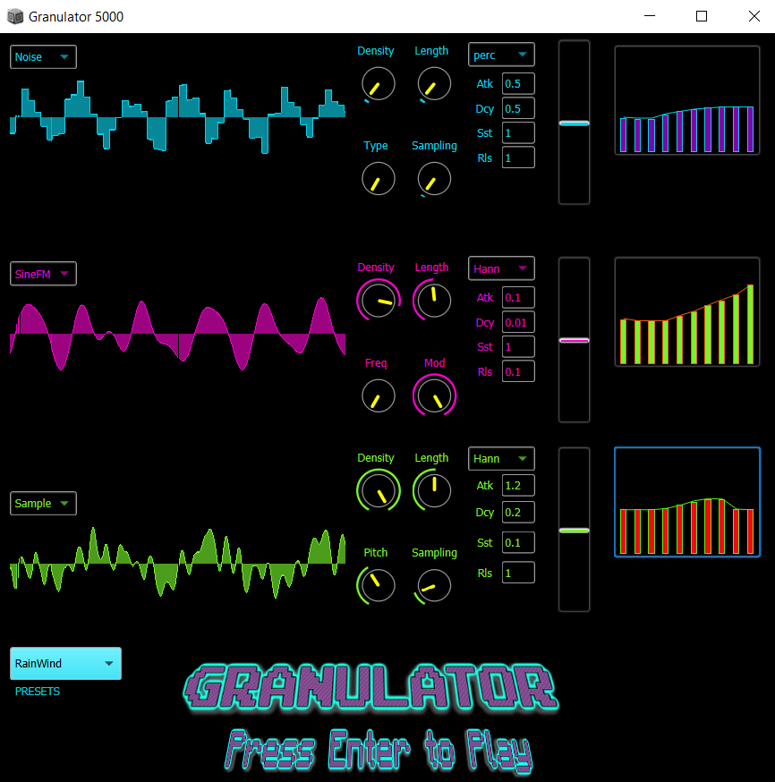
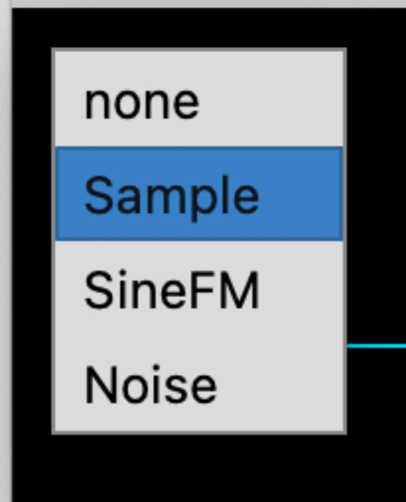
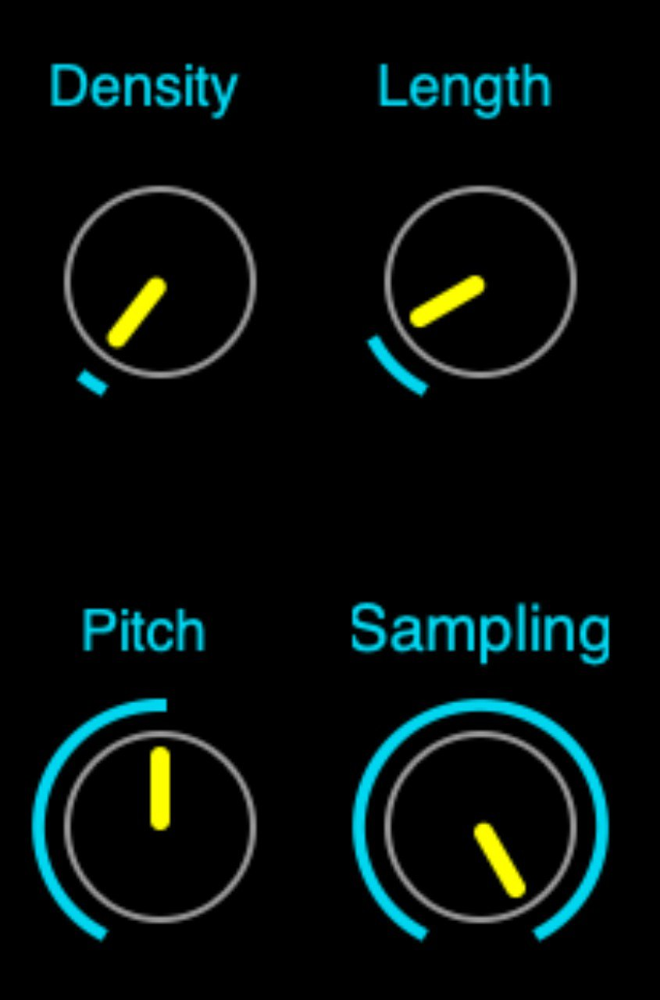
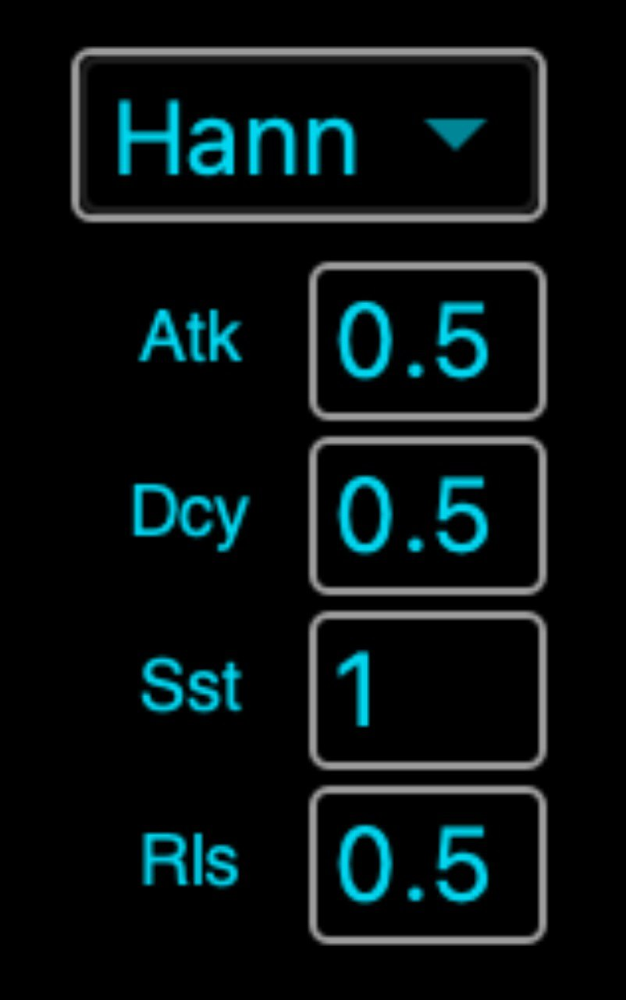
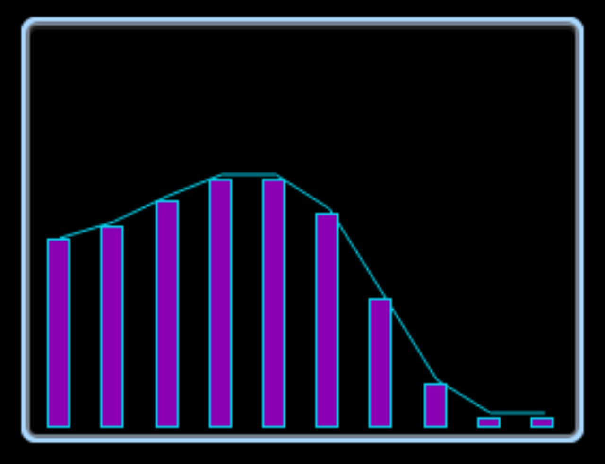
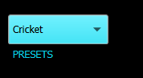

Granulator 5000 is a virtual instrument based on granular synthesis specially develop for "retro" video games sound design. Feel free to load your own samples or to use the build-in signals inside the synthesizer (SineFM or Noise) to "granulate" your own Foley sound effects. Also, you can load one of the 7 foley and soundscapes presents (Foot steps, Laser Gun, explosion, spooky, etc).

# How to start
1. Boot the server and run the code.
2.  Choose your input signal 
 

2. Modify the grain parameters
 
There are 4 parameters the user can change. density and length of the grains are common for all signals, while the other two knobs change from a Synth to the other: 
 
- When a Sample is loaded,  the parameters assigned to the other two knobs are: "Pitch" which allows to modify the play rate of the output and "Sampling" which allows to change the sampling frequency of the output signal;  
-  For the Noise, instead of Pitch, a knob ("Type") for selecting the desired Type of Noise is implemented (brown noise, pink noise, white noise or crackle); 
-  For the SineFM, the parameters assigned to the other two knobs are: "Freq" which represents the frequency of the sinusoid and "Mod" which represents the frequency of the moulating signal.  

3. Set your envelope
 
There is also the possibility to manipulate the envelope of the signal through the four boxes (Atk, Dcy, Sst, Rls) present in each channel. The shape is a classic ADSR envelope and you can type the duration in second of each segment.

4. Equalize!

With this feature you can control the frequency content of the signal by attenuating o accentuating each octave band

5. Additionally you can load one of the 7 presets feature inside the program!

